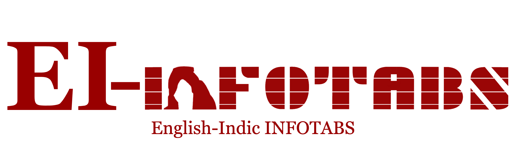

The Official dataset for the NAACL 2022 Main Conference Oral titled, ["Bilingual Tabular Inference: A Case Study on Indic Languages"](https://aclanthology.org/2022.naacl-main.295/), containing Hypotheses in 11 Indian Languages i.e. Assamese (as), Bengali (bn), Gujarati (gu), Hindi(hi), Kannada(kn), Malayalam(ml), Marathi(mr), Oriya(or), Punjabi(pa), Tamil(ta) and Telegu(te).

# Data
Upon downloading this repository, one will find the hypotheses in the `data` folder. Corresponding premise tables can be found at [InfoTabS](https://github.com/infotabs/infotabs).
```
data/
├── as/
│   ├── infotabs_dev.tsv
│   ├── infotabs_test_alpha1.tsv
│   ├── infotabs_test_alpha2.tsv
│   ├── infotabs_test_alpha3.tsv
│   └── infotabs_train.tsv
├── bn/
│   ├── ...
├── gu/
│   ├── ...
├── hi/
│   ├── ...
├── kn/
│   ├── ...
├── ml/
│   ├── ...
├── mr/
│   ├── ...
├── or/
│   ├── ...
├── pa/
│   ├── ...
├── ta/
│   ├── ...
└── te/
    ├── ...

11 directories, 55 files
```


# Citation

Cite us if you are using the data or the code in your own project, with the following BibTex:

```bibtex
@inproceedings{agarwal-etal-2022-bilingual,
    title = "Bilingual Tabular Inference: A Case Study on Indic Languages",
    author = "Agarwal, Chaitanya  and
      Gupta, Vivek  and
      Kunchukuttan, Anoop  and
      Shrivastava, Manish",
    booktitle = "Proceedings of the 2022 Conference of the North American Chapter of the Association for Computational Linguistics: Human Language Technologies",
    month = jul,
    year = "2022",
    address = "Seattle, United States",
    publisher = "Association for Computational Linguistics",
    url = "https://aclanthology.org/2022.naacl-main.295",
    pages = "4018--4037",
    abstract = "Existing research on Tabular Natural Language Inference (TNLI) exclusively examines the task in a monolingual setting where the tabular premise and hypothesis are in the same language. However, due to the uneven distribution of text resources on the web across languages, it is common to have the tabular premise in a high resource language and the hypothesis in a low resource language. As a result, we present the challenging task of bilingual Tabular Natural Language Inference (bTNLI), in which the tabular premise and a hypothesis over it are in two separate languages. We construct EI-InfoTabS: an English-Indic bTNLI dataset by translating the textual hypotheses of the English TNLI dataset InfoTabS into eleven major Indian languages. We thoroughly investigate how pre-trained multilingual models learn and perform on EI-InfoTabS. Our study shows that the performance on bTNLI can be close to its monolingual counterpart, with translate-train, translate-test and unified-train being strongly competitive baselines.",
}
```
